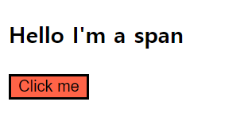
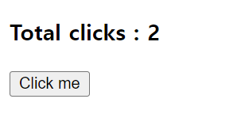
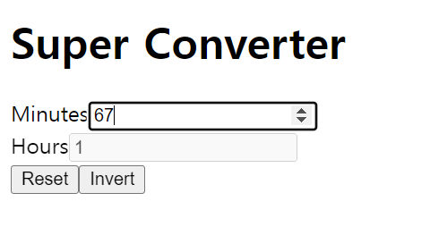
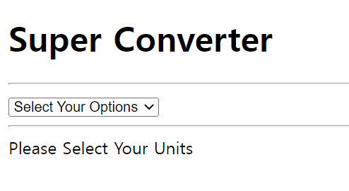
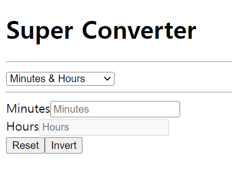
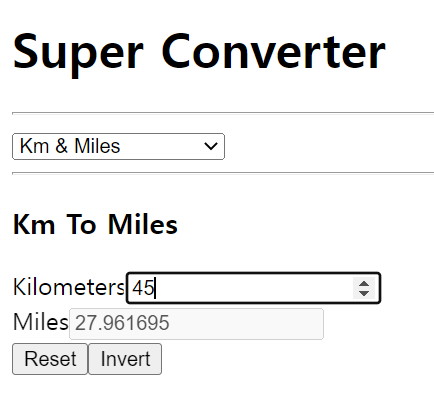
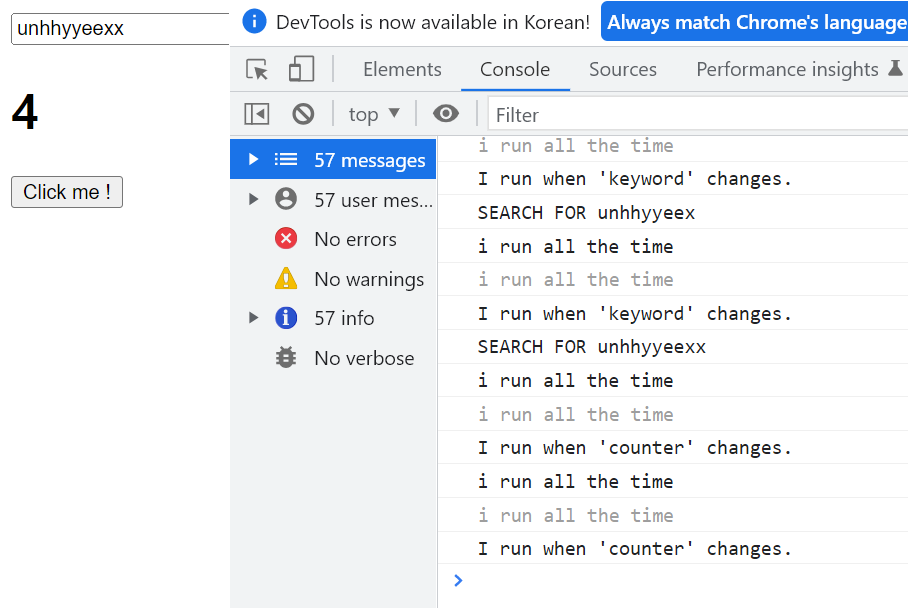

# React-Beginner
React Basic Study


## index.html




## state.html, state2.html




## input & state .html




## StateFinalPractice.html








## Effect

#### useEffect

- 두 개의 argument를 가지는 function
- 첫번째 argument에는 실행하고 싶은 코드 작성
- 두번째 argument에는 특정 keyword 가 변화할 때 코드를 실행하고 싶을 때 그 keyword작성
- useEffect에는 component가 처음 render할 때 실행되고 다시는 실행되지 않을 function 작성




> react.js에서는 component를 refresh할 수 있음 => 새로운 데이터가 들어올때마다
>
> 변화가 일어날 때만 re-render할 수도 있음


useEffect

> 첫번째 argument ; 실행시키고 싶은 코드
>
> 두번째 argument ; dependencies ; react.js가 지켜봐야하는 값
>
> ​	=> 이것들이 변화할 때 react.js가 코드 실행을 시킴


```react
useEffect(()=>{
    console.log("I run only once")
  }, [])

// react.js가 지켜보는 값이 없기 때문에 (no 2nd argument) 처음 render할때 한 번 실행
```

```react
useEffect(()=> {
      console.log("I run when 'keyword' changes." )
    }, [keyword])

// 2nd argument에 있는 keyword(state안에 있음)을 지켜보고 keyword가 변화할 때 코드 실행
```

